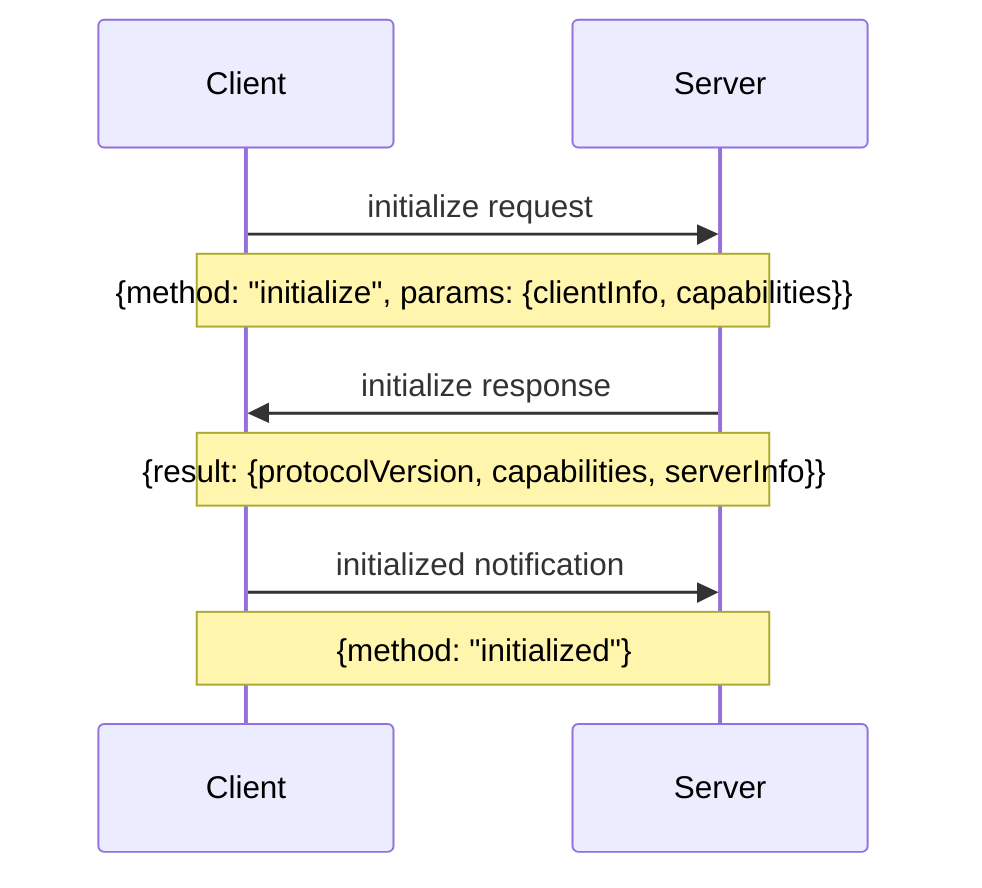
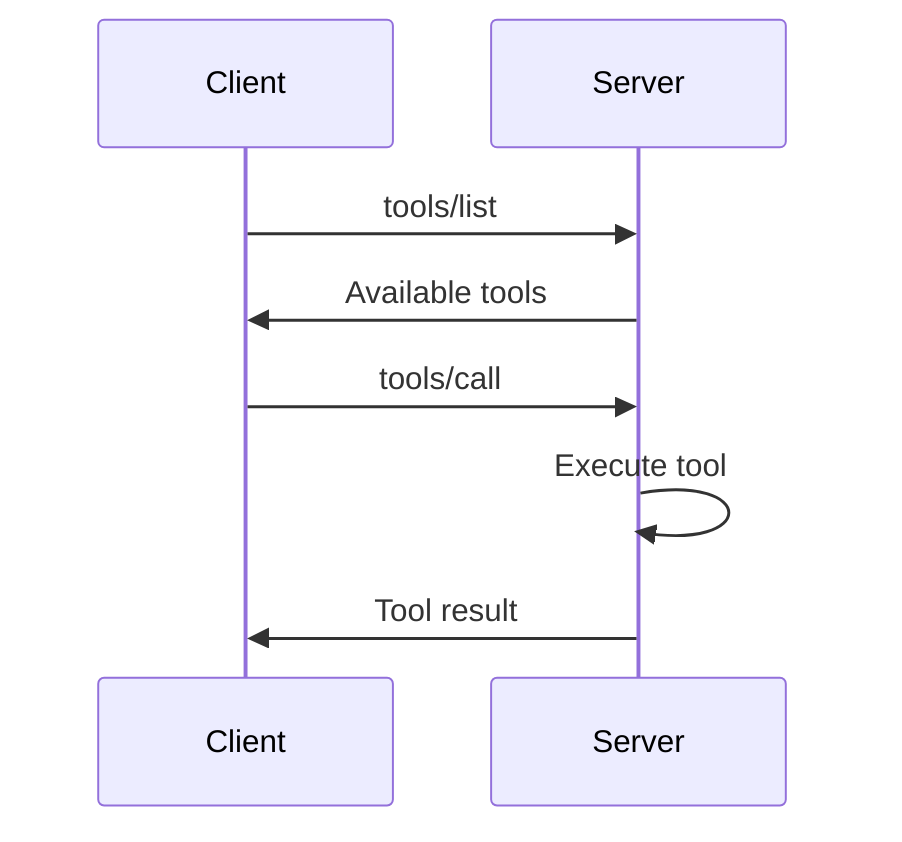

# MCP Protocol Deep Dive

## Table of Contents

1. [Introduction to MCP](#introduction-to-mcp)
2. [Protocol Fundamentals](#protocol-fundamentals)
3. [Message Types and Flow](#message-types-and-flow)
4. [Tools System](#tools-system)
5. [Resources System](#resources-system)
6. [Session Management](#session-management)
7. [Error Handling](#error-handling)
8. [SSE Transport Layer](#sse-transport-layer)
9. [Implementation Examples](#implementation-examples)
10. [Best Practices](#best-practices)

## Introduction to MCP

The Model Context Protocol (MCP) is a standardized communication protocol designed to enable AI assistants to interact with external tools, access resources, and maintain context across conversations. It's built on JSON-RPC 2.0 and designed for real-time, bidirectional communication.

### Key Concepts

- **Client**: The AI assistant (e.g., GitHub Copilot)
- **Server**: The MCP implementation providing tools and resources
- **Transport**: The communication mechanism (HTTP + SSE in our case)
- **Session**: A stateful connection between client and server

## Protocol Fundamentals

### JSON-RPC 2.0 Base

MCP uses JSON-RPC 2.0 as its foundation:

```json
{
  "jsonrpc": "2.0",
  "method": "methodName",
  "params": {
    "param1": "value1"
  },
  "id": "unique-request-id"
}
```

### Message Categories

1. **Requests**: Client-initiated calls expecting responses
2. **Responses**: Server replies to requests
3. **Notifications**: One-way messages (no response expected)
4. **Errors**: Standardized error responses

## Message Types and Flow

### 1. Initialization Flow



**Initialize Request**:
```json
{
  "jsonrpc": "2.0",
  "method": "initialize",
  "params": {
    "clientInfo": {
      "name": "GitHub Copilot",
      "version": "1.0.0"
    },
    "capabilities": {
      "tools": true,
      "resources": true,
      "prompts": true,
      "sampling": true
    }
  },
  "id": "init-001"
}
```

**Initialize Response**:
```json
{
  "jsonrpc": "2.0",
  "result": {
    "protocolVersion": "1.0",
    "capabilities": {
      "tools": true,
      "resources": true,
      "prompts": true,
      "sampling": true
    },
    "serverInfo": {
      "name": "Azure MCP Server",
      "version": "1.0.0"
    }
  },
  "id": "init-001"
}
```

### 2. Tool Discovery and Execution



**List Tools Request**:
```json
{
  "jsonrpc": "2.0",
  "method": "tools/list",
  "id": "tools-001"
}
```

**List Tools Response**:
```json
{
  "jsonrpc": "2.0",
  "result": {
    "tools": [
      {
        "name": "analyze_code",
        "description": "Analyze code for patterns, issues, and improvements",
        "inputSchema": {
          "type": "object",
          "properties": {
            "code": {
              "type": "string",
              "description": "Code to analyze"
            },
            "language": {
              "type": "string",
              "description": "Programming language"
            },
            "analysis_type": {
              "type": "string",
              "enum": ["security", "performance", "quality", "all"],
              "description": "Type of analysis"
            }
          },
          "required": ["code", "language"]
        }
      }
    ]
  },
  "id": "tools-001"
}
```

**Call Tool Request**:
```json
{
  "jsonrpc": "2.0",
  "method": "tools/call",
  "params": {
    "name": "analyze_code",
    "arguments": {
      "code": "def factorial(n):\n    return 1 if n <= 1 else n * factorial(n-1)",
      "language": "python",
      "analysis_type": "all"
    }
  },
  "id": "call-001"
}
```

**Call Tool Response**:
```json
{
  "jsonrpc": "2.0",
  "result": {
    "toolResult": {
      "analysis": {
        "security": {
          "issues": [],
          "score": 10
        },
        "performance": {
          "issues": [
            {
              "type": "recursion",
              "message": "Recursive implementation may cause stack overflow for large inputs",
              "line": 2,
              "severity": "warning"
            }
          ],
          "score": 7
        },
        "quality": {
          "issues": [
            {
              "type": "documentation",
              "message": "Function lacks docstring",
              "line": 1,
              "severity": "info"
            }
          ],
          "score": 8
        }
      },
      "summary": "Code is functional but could benefit from iterative implementation and documentation"
    }
  },
  "id": "call-001"
}
```

### 3. Resource Access

**List Resources**:
```json
{
  "jsonrpc": "2.0",
  "method": "resources/list",
  "id": "res-001"
}
```

**Read Resource**:
```json
{
  "jsonrpc": "2.0",
  "method": "resources/read",
  "params": {
    "uri": "resource://docs/api-guide"
  },
  "id": "res-002"
}
```

## Tools System

### Tool Definition Structure

```python
class Tool:
    name: str              # Unique identifier
    description: str       # Human-readable description
    inputSchema: dict      # JSON Schema for validation
```

### Tool Implementation Pattern

```python
class MCPToolHandler:
    def __init__(self):
        self.tools = {}
        self._register_tools()
    
    def _register_tools(self):
        self.tools["analyze_code"] = {
            "handler": self.analyze_code,
            "schema": {
                "type": "object",
                "properties": {
                    "code": {"type": "string"},
                    "language": {"type": "string"}
                },
                "required": ["code", "language"]
            }
        }
    
    async def execute_tool(self, name: str, arguments: dict) -> dict:
        if name not in self.tools:
            raise ToolNotFoundError(f"Tool '{name}' not found")
        
        # Validate arguments
        validate(arguments, self.tools[name]["schema"])
        
        # Execute tool
        return await self.tools[name]["handler"](arguments)
    
    async def analyze_code(self, arguments: dict) -> dict:
        code = arguments["code"]
        language = arguments["language"]
        
        # Perform analysis
        analysis_result = await self._perform_analysis(code, language)
        
        return {
            "status": "success",
            "result": analysis_result
        }
```

### Advanced Tool Features

1. **Streaming Results**:
```python
async def generate_code_streaming(self, arguments: dict):
    prompt = arguments["prompt"]
    
    async for chunk in self._generate_code(prompt):
        yield {
            "type": "progress",
            "content": chunk
        }
    
    yield {
        "type": "complete",
        "content": "Generation complete"
    }
```

2. **Long-Running Tools**:
```python
async def long_running_analysis(self, arguments: dict):
    job_id = str(uuid.uuid4())
    
    # Start async job
    asyncio.create_task(self._run_analysis(job_id, arguments))
    
    # Return job ID immediately
    return {
        "status": "accepted",
        "jobId": job_id,
        "message": "Analysis started. Check status with job ID."
    }
```

## Resources System

### Resource Types

1. **Text Resources**: Documentation, configurations
2. **Data Resources**: JSON, CSV, structured data
3. **Binary Resources**: Images, files
4. **Dynamic Resources**: Generated content

### Resource Implementation

```python
class ResourceManager:
    def __init__(self):
        self.resources = {}
        self._register_resources()
    
    def _register_resources(self):
        self.resources["docs/api"] = {
            "type": "text",
            "mimeType": "text/markdown",
            "handler": self._get_api_docs
        }
        
        self.resources["config/settings"] = {
            "type": "data",
            "mimeType": "application/json",
            "handler": self._get_settings
        }
    
    async def read_resource(self, uri: str) -> dict:
        if uri not in self.resources:
            raise ResourceNotFoundError(f"Resource '{uri}' not found")
        
        resource = self.resources[uri]
        content = await resource["handler"]()
        
        return {
            "contents": [{
                "uri": uri,
                "mimeType": resource["mimeType"],
                "text": content if resource["type"] == "text" else None,
                "data": content if resource["type"] == "data" else None
            }]
        }
```

## Session Management

### Session Lifecycle

```python
class SessionManager:
    def __init__(self):
        self.sessions = {}
        self.session_timeout = timedelta(hours=1)
    
    def create_session(self, user_id: str, client_info: dict) -> str:
        session_id = str(uuid.uuid4())
        
        self.sessions[session_id] = {
            "id": session_id,
            "user_id": user_id,
            "client_info": client_info,
            "created_at": datetime.utcnow(),
            "last_activity": datetime.utcnow(),
            "state": {},
            "active_connections": {
                "sse": None,
                "command": None
            }
        }
        
        return session_id
    
    def update_activity(self, session_id: str):
        if session_id in self.sessions:
            self.sessions[session_id]["last_activity"] = datetime.utcnow()
    
    def cleanup_expired_sessions(self):
        now = datetime.utcnow()
        expired = [
            sid for sid, session in self.sessions.items()
            if now - session["last_activity"] > self.session_timeout
        ]
        
        for sid in expired:
            self.close_session(sid)
```

### Session State Management

```python
class StatefulSession:
    def __init__(self, session_id: str):
        self.session_id = session_id
        self.state = {}
        self.message_queue = asyncio.Queue()
        self.active_tools = {}
    
    async def set_state(self, key: str, value: Any):
        self.state[key] = value
        
        # Notify client of state change
        await self.send_notification({
            "method": "session/stateChanged",
            "params": {
                "key": key,
                "value": value
            }
        })
    
    async def get_state(self, key: str) -> Any:
        return self.state.get(key)
```

## Error Handling

### Standard Error Codes

```python
class MCPErrorCodes:
    PARSE_ERROR = -32700          # Invalid JSON
    INVALID_REQUEST = -32600      # Invalid request structure
    METHOD_NOT_FOUND = -32601     # Unknown method
    INVALID_PARAMS = -32602       # Invalid parameters
    INTERNAL_ERROR = -32603       # Server error
    
    # Custom MCP errors
    AUTHENTICATION_ERROR = -32000
    AUTHORIZATION_ERROR = -32001
    RESOURCE_NOT_FOUND = -32002
    TOOL_NOT_FOUND = -32003
    TOOL_EXECUTION_ERROR = -32004
    SESSION_EXPIRED = -32005
```

### Error Response Format

```json
{
  "jsonrpc": "2.0",
  "error": {
    "code": -32602,
    "message": "Invalid params",
    "data": {
      "field": "language",
      "error": "Language 'xyz' is not supported",
      "supported": ["python", "javascript", "java", "go"]
    }
  },
  "id": "req-001"
}
```

### Error Handling Implementation

```python
class MCPErrorHandler:
    @staticmethod
    def create_error_response(
        request_id: str,
        code: int,
        message: str,
        data: Optional[dict] = None
    ) -> dict:
        error_response = {
            "jsonrpc": "2.0",
            "error": {
                "code": code,
                "message": message
            },
            "id": request_id
        }
        
        if data:
            error_response["error"]["data"] = data
        
        return error_response
    
    @staticmethod
    async def handle_error(e: Exception, request_id: str) -> dict:
        if isinstance(e, ToolNotFoundError):
            return MCPErrorHandler.create_error_response(
                request_id,
                MCPErrorCodes.TOOL_NOT_FOUND,
                str(e),
                {"availableTools": list(tool_registry.keys())}
            )
        elif isinstance(e, ValidationError):
            return MCPErrorHandler.create_error_response(
                request_id,
                MCPErrorCodes.INVALID_PARAMS,
                "Parameter validation failed",
                {"errors": e.errors()}
            )
        else:
            # Log unexpected errors
            logger.error(f"Unexpected error: {e}", exc_info=True)
            
            return MCPErrorHandler.create_error_response(
                request_id,
                MCPErrorCodes.INTERNAL_ERROR,
                "An internal error occurred"
            )
```

## SSE Transport Layer

### SSE Message Format

```
event: message
data: {"jsonrpc":"2.0","method":"notification","params":{}}

event: heartbeat
data: {"timestamp":"2024-01-01T12:00:00Z"}

event: error
data: {"error":"Connection lost"}
```

### SSE Implementation

```python
class SSETransport:
    def __init__(self, session: Session):
        self.session = session
        self.active = True
        self.heartbeat_interval = 30  # seconds
    
    async def stream(self) -> AsyncGenerator[str, None]:
        # Send initial connection event
        yield self._format_event("connected", {
            "session_id": self.session.session_id,
            "protocol_version": "1.0"
        })
        
        # Start heartbeat task
        heartbeat_task = asyncio.create_task(self._heartbeat_loop())
        
        try:
            while self.active:
                try:
                    # Wait for messages with timeout
                    message = await asyncio.wait_for(
                        self.session.message_queue.get(),
                        timeout=1.0
                    )
                    
                    yield self._format_event("message", message)
                    
                except asyncio.TimeoutError:
                    # No message, continue loop
                    continue
                    
        finally:
            heartbeat_task.cancel()
            self.active = False
    
    async def _heartbeat_loop(self):
        while self.active:
            await asyncio.sleep(self.heartbeat_interval)
            
            if self.active:
                await self.session.message_queue.put({
                    "type": "heartbeat",
                    "timestamp": datetime.utcnow().isoformat()
                })
    
    def _format_event(self, event_type: str, data: dict) -> str:
        return f"event: {event_type}\ndata: {json.dumps(data)}\n\n"
```

### Client-Side SSE Handling

```typescript
class MCPSSEClient {
    private eventSource: EventSource;
    private messageHandlers: Map<string, Function>;
    
    constructor(private url: string, private token: string) {
        this.messageHandlers = new Map();
        this.setupDefaultHandlers();
    }
    
    connect(): Promise<void> {
        return new Promise((resolve, reject) => {
            this.eventSource = new EventSource(this.url, {
                headers: {
                    'Authorization': `Bearer ${this.token}`
                }
            });
            
            this.eventSource.addEventListener('connected', (event) => {
                const data = JSON.parse(event.data);
                console.log('Connected with session:', data.session_id);
                resolve();
            });
            
            this.eventSource.addEventListener('message', (event) => {
                const message = JSON.parse(event.data);
                this.handleMessage(message);
            });
            
            this.eventSource.addEventListener('error', (event) => {
                console.error('SSE error:', event);
                this.reconnect();
            });
        });
    }
    
    private handleMessage(message: any) {
        if (message.id && this.messageHandlers.has(message.id)) {
            const handler = this.messageHandlers.get(message.id)!;
            handler(message);
            this.messageHandlers.delete(message.id);
        } else if (message.method) {
            // Handle notifications
            this.handleNotification(message);
        }
    }
    
    private async reconnect() {
        console.log('Attempting to reconnect...');
        await new Promise(resolve => setTimeout(resolve, 5000));
        await this.connect();
    }
}
```

## Implementation Examples

### Complete MCP Server

```python
from typing import Dict, Any, Optional
import asyncio
import json
from datetime import datetime

class MCPServer:
    def __init__(self):
        self.tools = ToolRegistry()
        self.resources = ResourceManager()
        self.sessions = SessionManager()
        self.error_handler = MCPErrorHandler()
    
    async def handle_request(
        self, 
        request: dict, 
        session_id: str
    ) -> dict:
        """Main request handler"""
        try:
            # Validate request structure
            if "jsonrpc" not in request or request["jsonrpc"] != "2.0":
                raise InvalidRequestError("Invalid JSON-RPC version")
            
            if "method" not in request:
                raise InvalidRequestError("Method is required")
            
            method = request["method"]
            params = request.get("params", {})
            request_id = request.get("id")
            
            # Update session activity
            self.sessions.update_activity(session_id)
            
            # Route to appropriate handler
            if method == "initialize":
                result = await self._handle_initialize(params, session_id)
            elif method == "tools/list":
                result = await self._handle_list_tools()
            elif method == "tools/call":
                result = await self._handle_call_tool(params)
            elif method == "resources/list":
                result = await self._handle_list_resources()
            elif method == "resources/read":
                result = await self._handle_read_resource(params)
            else:
                raise MethodNotFoundError(f"Unknown method: {method}")
            
            # Return successful response
            if request_id is not None:
                return {
                    "jsonrpc": "2.0",
                    "result": result,
                    "id": request_id
                }
            else:
                # Notification - no response
                return None
                
        except Exception as e:
            # Handle errors
            if request_id is not None:
                return await self.error_handler.handle_error(e, request_id)
            else:
                # Error in notification - log but don't respond
                logger.error(f"Error in notification: {e}")
                return None
```

### Advanced Tool Implementation

```python
class AdvancedCodeAnalyzer:
    def __init__(self):
        self.analyzers = {
            "security": SecurityAnalyzer(),
            "performance": PerformanceAnalyzer(),
            "quality": QualityAnalyzer()
        }
    
    async def analyze(
        self, 
        code: str, 
        language: str, 
        analysis_type: str = "all"
    ) -> dict:
        """Perform comprehensive code analysis"""
        
        # Parse code
        ast = await self._parse_code(code, language)
        
        # Run requested analyzers
        results = {}
        
        if analysis_type == "all":
            analyzers_to_run = self.analyzers.keys()
        else:
            analyzers_to_run = [analysis_type]
        
        # Run analyzers in parallel
        tasks = []
        for analyzer_name in analyzers_to_run:
            if analyzer_name in self.analyzers:
                analyzer = self.analyzers[analyzer_name]
                tasks.append(
                    self._run_analyzer(analyzer_name, analyzer, ast, code)
                )
        
        analyzer_results = await asyncio.gather(*tasks)
        
        # Combine results
        for name, result in analyzer_results:
            results[name] = result
        
        # Generate summary
        summary = self._generate_summary(results)
        
        return {
            "analysis": results,
            "summary": summary,
            "metadata": {
                "language": language,
                "lines": len(code.splitlines()),
                "analyzed_at": datetime.utcnow().isoformat()
            }
        }
    
    async def _run_analyzer(
        self, 
        name: str, 
        analyzer: Any, 
        ast: Any, 
        code: str
    ) -> tuple:
        """Run a single analyzer"""
        try:
            result = await analyzer.analyze(ast, code)
            return (name, result)
        except Exception as e:
            logger.error(f"Analyzer {name} failed: {e}")
            return (name, {
                "error": str(e),
                "status": "failed"
            })
    
    def _generate_summary(self, results: dict) -> str:
        """Generate human-readable summary"""
        issues_count = sum(
            len(r.get("issues", [])) 
            for r in results.values() 
            if isinstance(r, dict)
        )
        
        if issues_count == 0:
            return "Code analysis completed. No issues found."
        elif issues_count < 5:
            return f"Code analysis completed. Found {issues_count} minor issues."
        else:
            return f"Code analysis completed. Found {issues_count} issues that should be addressed."
```

## Best Practices

### 1. Protocol Implementation

- **Version Negotiation**: Always check protocol version during initialization
- **Capability Discovery**: Respect client capabilities
- **Graceful Degradation**: Handle missing features elegantly

### 2. Performance

- **Async Everything**: Use async/await for all I/O operations
- **Connection Pooling**: Reuse connections where possible
- **Caching**: Cache frequently accessed resources
- **Pagination**: Implement pagination for large result sets

### 3. Security

- **Input Validation**: Always validate tool arguments
- **Output Sanitization**: Sanitize tool outputs
- **Rate Limiting**: Implement per-user rate limits
- **Audit Logging**: Log all tool executions

### 4. Error Handling

- **Descriptive Errors**: Provide helpful error messages
- **Error Recovery**: Implement retry logic where appropriate
- **Graceful Failures**: Don't crash on individual tool failures

### 5. Testing

```python
# Example test for MCP server
import pytest
from unittest.mock import AsyncMock

@pytest.mark.asyncio
async def test_tool_execution():
    server = MCPServer()
    
    # Mock tool
    mock_tool = AsyncMock(return_value={"result": "success"})
    server.tools.register("test_tool", mock_tool)
    
    # Test request
    request = {
        "jsonrpc": "2.0",
        "method": "tools/call",
        "params": {
            "name": "test_tool",
            "arguments": {"param": "value"}
        },
        "id": "test-001"
    }
    
    # Execute
    response = await server.handle_request(request, "test-session")
    
    # Verify
    assert response["result"]["toolResult"]["result"] == "success"
    mock_tool.assert_called_once_with({"param": "value"})
```

---

This deep dive provides a comprehensive understanding of the MCP protocol, its implementation details, and best practices for building robust MCP servers. The protocol's flexibility allows for extensive customization while maintaining compatibility with AI assistants like GitHub Copilot.